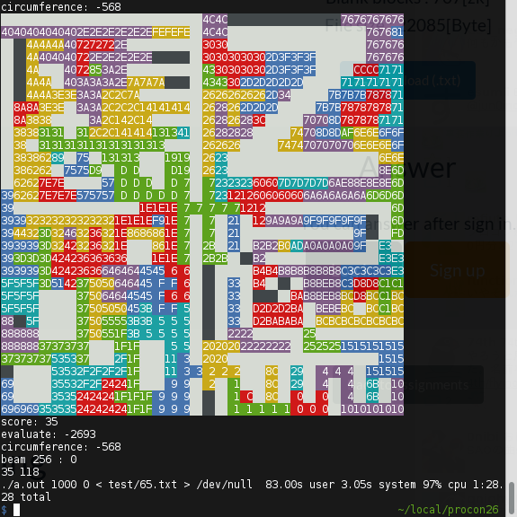
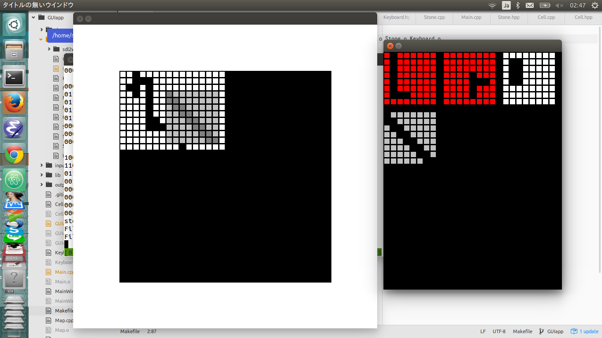

# 高専プロコン 競技部門 神戸大学

## ビームサーチ

ビームサーチです

[解説記事](http://solorab.net/blog/2015/10/13/procon26-program/)

-   予選 1位
-   朝のOB戦 2位
-   準決勝 2位
-   決勝 4位
-   エキシビションマッチ 6位



### 使い方

```
    $ make build/fast
    $ ./a.out BEAM_WIDTH TIME_LIMIT [IS_CHOKUDAI] < quest.txt > result.txt
```

-   `TIME_LIMIT`が非零なら、`BEAM_WIDTH`幅で実行したあと、その実行時間を元に幅を決めて再度実行
-   `IS_CHOKUDAI`に1を入れるとchokudai-search
-   `./best` `./token`を適当にした後、`... | ./submit.py quest.txt`と繋ぐと、自動提出器が走る
    -   逐次提出には`NPRACTICE=t make ...`とする
-   compileできないとか疑問点とかあればissue建てるとかtwitterで聞くとかしてください

### license

MIT License

## 補助ツール

SDL2.0,SDL2_image,SDL2_gfx,SDL2_ttfが必要です

``` sh
    $ cd GUIapp
    $ make
    $ ./GUIapp.elf <game num>
```

-Tabキー: 裏返す
-Spaceキー: 90度回転


<del> 結局起動すらしなかったのほんと申し分けない </del>

## linkとか

-   <http://www.procon.gr.jp/>
-   <http://www.procon.gr.jp/uploads/procon26/Apply26.pdf>
-   <http://en.wikipedia.org/wiki/Exact_cover>
